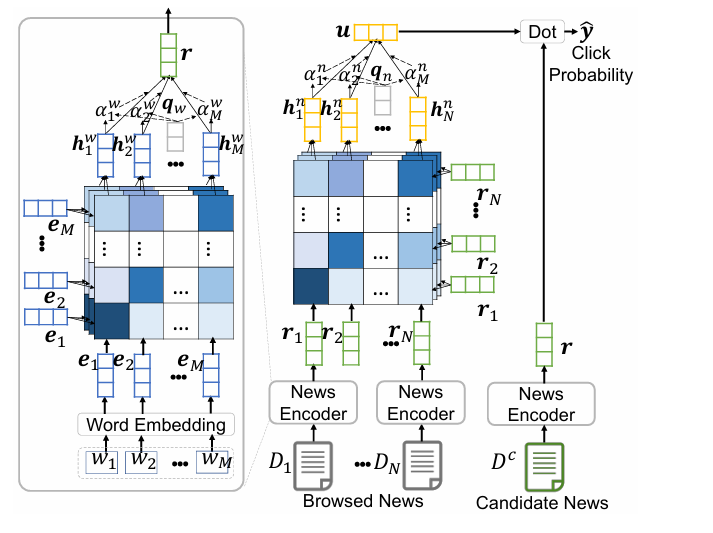

# 工作

本项目复现NRMS模型(pytorch)，并未做改进。

# NRMS

NRMS（Neural News Recommendation with Multi-Head Self-Attention）是微软在 MIND 数据集论文中提出的经典新闻推荐模型，核心目标是**通过自注意力机制同时建模新闻内容表示和用户兴趣表示**。

模型结构上，NRMS主要由三部分组成。第一是新闻编码器（News Encoder）：将**新闻标题中的词向量**输入多头自注意力（Multi-Head Self-Attention），捕捉标题内部的关键词依赖关系，再通过**加性注意力**汇聚为**单条新闻的向量表示**。

第二是用户编码器（User Encoder）：将**用户历史点击新闻的向量序列**作为输入，再次使用多头自注意力建模用户兴趣的多样性和长期依赖，得到用户兴趣表示。

第三是匹配与预测：通过用户向量与候选新闻向量的**点积**计算点击得分，并在训练阶段结合负采样进行优化。

NRMS的主要特点是完全基于注意力机制，不依赖RNN或CNN，能够并行计算，效率较高；多头机制可以刻画用户多兴趣结构，在新闻推荐场景中效果稳定。其局限在于主要利用标题文本信息，对时序、上下文和用户短期兴趣的刻画相对有限，通常作为强基线模型使用。

## 数据集

基于论文使用的Mind数据集（https://msnews.github.io/）在网上开源的版本并不全，无法训练得到论文中的效果，考虑到机器的性能使用Mind-small数据集。已经提前已处理好（转换为parquet，分词...，并未在项目中展示）。

使用来自https://github.com/stanfordnlp/GloVe预训练好的词嵌入glove.2024.wikigiga.300d.zip，nrms中用的也是glove，但是版本不同。

## 得分
official——AUC:0.6275  nDCG@5:0.3217  nDCG@10:0.4139
original(epoch 10 lr=1e-3 )——AUC:0.6274  nDCG@5:0.3129  nDCG@10:0.3781
with ranger optimizer(epoch 10 lr=1e-3 )——AUC:0.6402  nDCG@5:0.3283  nDCG@10:0.3955

只训练10个epoch是因为论文中选取的就是10个epoch，同时其他参数也保持和论文一致（batch_size=64, 负采样的数量为4，nhead=16,encode_size=256...），注意论文中并没有公布学习率，这里选择使用1e-3。
